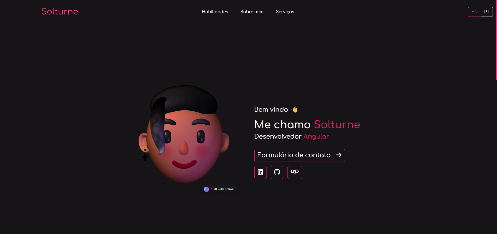

# 💼 Portfólio

---

Meu cantinho pessoal!  
Aqui você encontra um pouco sobre quem eu sou, minhas experiências como desenvolvedor e, em breve, também uma vitrine dos meus projetos mais legais.

🌐 **Acesse em:** [https://solturne.dev](https://solturne.dev)

---

## 🧩 Sobre o projeto

Esse site serve como uma introdução ao meu trabalho e como um meio de contato direto comigo.  
Ele foi pensado pra ser simples, rápido e direto ao ponto.

Por enquanto, ele traz informações básicas sobre mim, meus contatos e um formulário de contato diretp, mas o plano é expandir e incluir meus projetos desenvolvidos ao longo da jornada.

---

## ⚙️ Tecnologias usadas

O projeto é dividido entre **frontend** e **backend**:

- **Frontend:** [Angular](https://angular.io/) - hospedado em [Vercel](https://vercel.com/home)
- **Backend:** [Node.js (Express)](https://expressjs.com/) - hospedado em [Render](https://render.com/)
- **Serviço de e-mail:** [SendGrid](https://sendgrid.com/) – pra lidar com o envio de mensagens do formulário de contato

> 🧠 Obs: o backend fica em outro repositório separado.

---

## 🖼️ Preview

---

## 👤 Sobre o autor

Sou desenvolvedor apaixonado por criar soluções eficientes e escaláveis com Angular, Node.js e C#. Trabalho com aplicações web interativas e microsserviços, sempre buscando otimizar o desempenho de tudo.

**Erick / Solturne**  
Desenvolvedor Angular / Node.js / C#  
🕸️ [GitHub](https://github.com/s0lturn3)  
💼 [LinkedIn](https://www.linkedin.com/in/erick-carvalho-40a7471ba/)  
💻 [99Freelas](https://www.99freelas.com.br/user/Solturne)  
📗 [Upwork](https://www.upwork.com/freelancers/~01461935f19114c1bf?mp_source=share)  

---

## 🪪 Licença

Este projeto está sob a licença MIT.  
Sinta-se livre pra usar o código como quiser, só lembre de dar os devidos créditos. 😉
